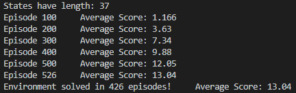
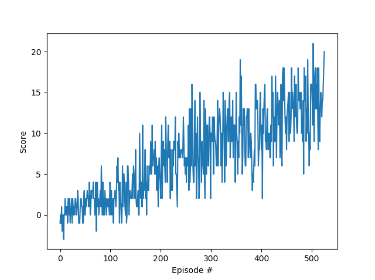

# Report

### Algorithm - Deep Q-Learning (DQN)

1. Deep Q-Learning utilizes a Neural Network as a function approximation for finding Q-values. The Neural network which I implemented had 3 fully connected layers. The first layers had 37 inputs, each representing the 37 states of the environment. Both the second and third hidden layers had 64 nuerons. The model had 4 outputs, representing the probability for each action. No dropout was included between layers of the model. This model is used to replace the optimal target values in the bellman equations with the apporoximated target values.

2. Deep Q-learning utilizes experience replay to retain experiences previuosly expored. These experiences are maintained in a buffer of size 1e5. Experience are added to the buffer at every iteration. At every c training steps, experiences are selected uniformly from the buffer and used to train the model.

3. Deep Q-learning utilizes fixed Q-targets which provides a more stable learning process. Having a fixed Q-target means a seperate network for generating the target values, softly updating this network weights by 1e-3 for every update made to the primary network.

### Results

### Improvements
**Double DQN**  
As specified in [this](https://arxiv.org/pdf/1509.06461.pdf) paper. Implementing Double DQN could reduces the observed overestimations made by the DQN algorithm and increase performance of the agent for this environment.

**Prioritized Experience Replay**  
As specified in [this](https://arxiv.org/pdf/1511.05952.pdf) paper. The agent could learn more efficiently if it makes use of prioritized experience replay, where experiences are sampled on a probability relative to the error of the experience.

**Dueling DQN**  
As specified in [this](https://arxiv.org/pdf/1511.06581.pdf) paper. The archictecture of the function approximator could be changed to represents two separate estimators: one for the state value function and one for the state-dependent action advantage function. The dueling architecture can learn which states are (or are not) valuable, without having to learn the effect of each action for each state.
 
 In summary, a combination of the four afformentioned improvements could be made to implement a "raindbow algorithm".